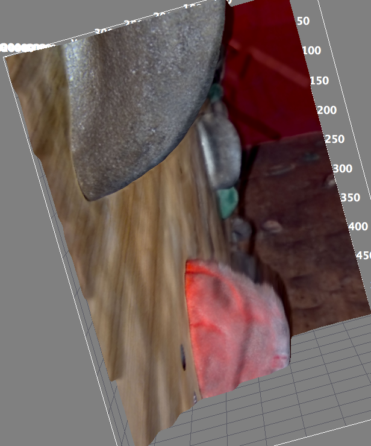

Making 3D Lightfield Plots
===================

A tutorial on how to make 3D surface plots from Lytro Depth Map images

## Setup

The easiest way to make these plots is to install the free, open-source [FIJI tool](http://fiji.sc/)

1. Download and install Fiji from http://fiji.sc/Downloads, make sure Java is installed as well. 
2. From Lytro Desktop, select the image and File->Export... as __Editable Depth Map (.png)__
3. You know have three files ```your_image.tiff```, ```your_image.png``` and ```your_image.txt```
4. Load ```your_image.png``` into FIJI
5. Select Plugins -> New -> Macro
6. Paste ```run("3D Surface Plot","plotType=3 grid=512 smooth=9 invertZ=1 scaleZ=0.2")``` into the field
7. Click Run
8. Click ```Load Texture``` and select "Load File from Disk" and choose the ```your_image.tiff``` file

## Examples
### Macro flower
- A flower taken very close up 

- A bouldering wall

